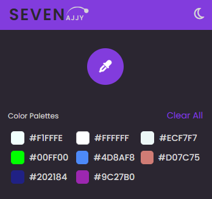

# ColorPicker-Extension

 

  
 

 

#
The ColorPicker extension will help us to pick the color from anywhere (browser / anywhere on the system) while storing the colors used. Provides a HexCode of this color that can be used in other projects.

# 🔧Tools Used
**Javascript / CSS / HTML / Chrome web APIs / Local storage**

